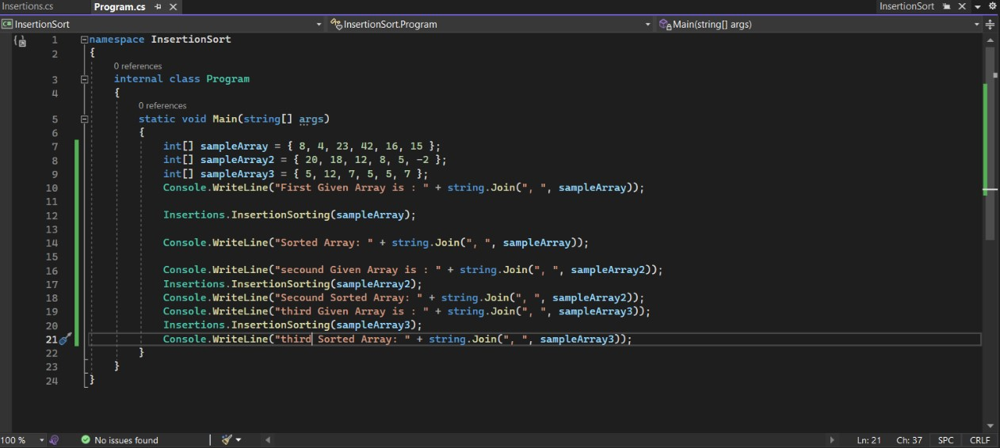
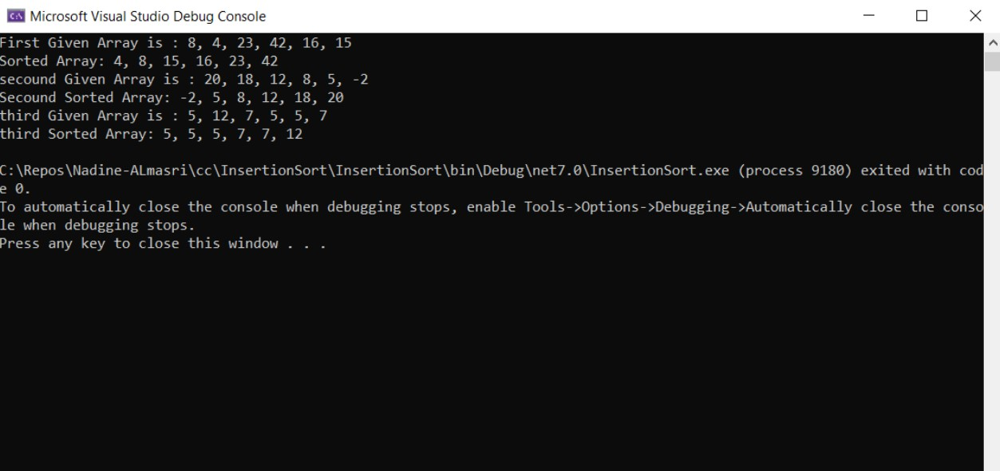
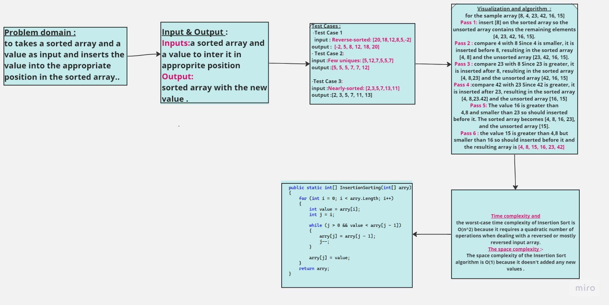

## Summary:
Insertion Sort is a simple sorting algorithm that builds the final sorted array one item at a time. It works by repeatedly taking an element from the unsorted portion and inserting it into its correct position within the sorted portion of the array. While not as efficient as other sorting algorithms for larger datasets, Insertion Sort is straightforward to implement and performs well on small lists or nearly sorted lists
## Description:
Insertion Sort operates by dividing the array into two portions: the sorted portion and the unsorted portion. Initially, the sorted portion contains only the first element of the array, and the unsorted portion contains the rest of the elements. The algorithm then iterates through the unsorted portion, comparing each element with the elements in the sorted portion. It shifts elements to the right within the sorted portion until the correct position is found for the current element. This process is repeated until the entire array is sorted.
## Visual:
Here's a visual representation of the Insertion Sort class:

## Approach & Efficiency:
- Insertion Sort has a time complexity of O(n^2) in the worst case because of the way it repeatedly compares and shifts elements to sort the array.

In the worst case scenario, when the input array is in reverse order, the algorithm has to perform the maximum number of comparisons and shifts at each step## WhiteBoard   

- The space complexity of the Insertion Sort algorithm is O(1) because it performs sorting in-place, meaning it doesn't require additional memory proportional to the input array size. It only uses a constant amount of extra space for temporary variables.
## Whiteboard :

