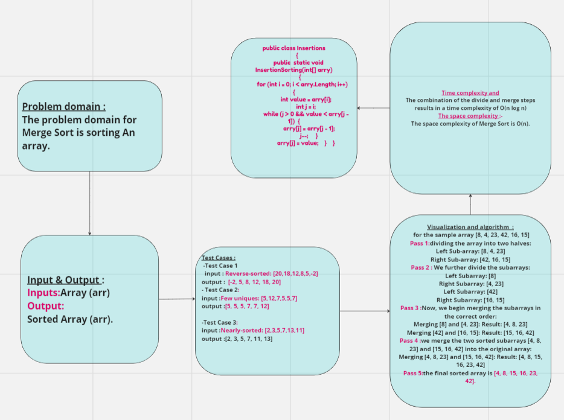
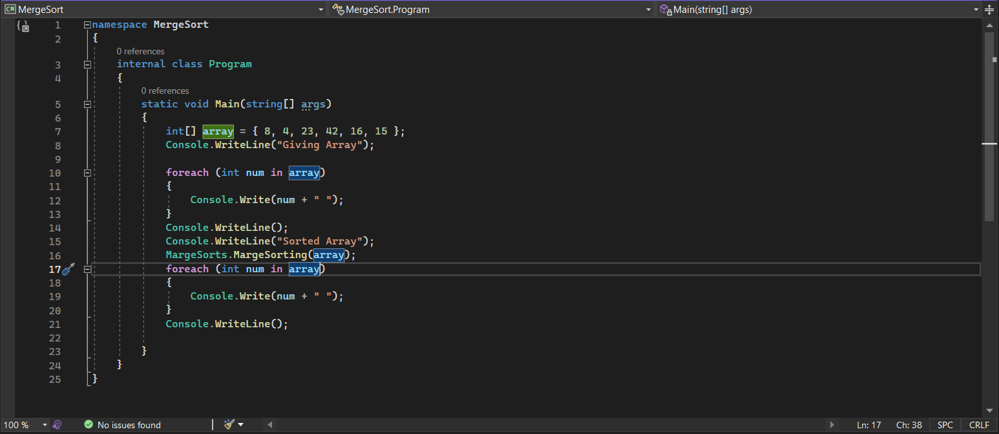
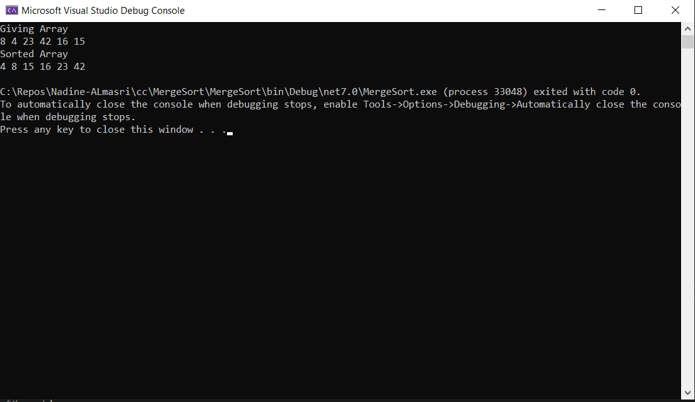

## Summary:
Merge Sort is a popular sorting algorithm known for its efficiency and ability to handle large datasets## Description:
## Visual:
Here's a visual representation of the Merge Sort class:

## Approach & Efficiency:
- The time complexity of the Merge Sort algorithm is O(n log n) in the worst, average, and best cases

- The space complexity of Merge Sort is O(n). It requires additional memory for the temporary storage of the subarrays during the sorting process.
## Whiteboard :

