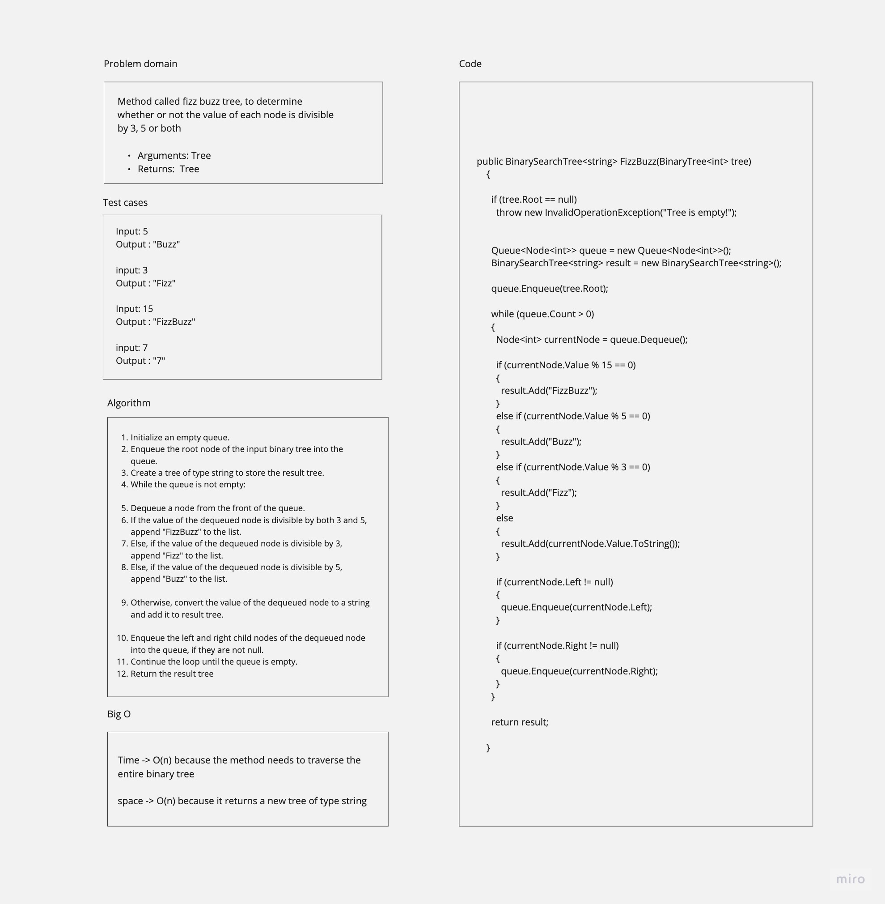

# Challenge Title
Trees implementation
Add a method to Find the Maximum Value in a Binary Tree


## Whiteboard Process


## Approach & Efficiency
In this project, I implemented a BinaryTree<<T>T> class, which represents a generic binary tree, and a BinarySearchTree<<T>T> class, which is a sub-class of BinaryTree<T> and represents a binary search tree.
The BinaryTree<T> class contains methods for depth-first traversals (pre-order, in-order, and post-order) to return arrays of values ordered appropriately.

Also, I added a method FindMaxValue to the BinaryTree<T> class to find the maximum value in the binary tree.

For the implementation of the FindMaxValue method, I used a recursive depth-first traversal approach starting from the root node. The method recursively explores the left and right subtrees to find the maximum value.


FindMaxValue: O(n) - The time complexity as it traverses all nodes once to find the maximum value.

## Solution

To use the binary tree and binary search tree classes, follow these steps:

- Include the BinaryTree<T> and BinarySearchTree<T> classes in your project.
-
Example
Here's an example of how to use the binary search tree to find the maximum value:


class Program
{
    static void Main()
    {
        // Create a binary search tree and add nodes
        BinarySearchTree<int> binarySearchTree = new BinarySearchTree<int>();
        binarySearchTree.Add(10);
        binarySearchTree.Add(5);
        binarySearchTree.Add(15);
        binarySearchTree.Add(3);
        binarySearchTree.Add(8);
        binarySearchTree.Add(20);

        int maxValue = binarySearchTree.FindMaxValue();
        Console.WriteLine("Maximum value in the binary tree: " + maxValue);
    }
}
Output:

Maximum value in the binary tree: 20


// CC-17

# Binary Tree Breadth-First Traversal

## Description
A method to implement a breadth-first traversal algorithm for a binary tree, and returns a list of all values encountered in the order they were encountered.
**breadth-first traversal visits all the nodes of the binary tree level by level, from left to right**

## Whiteboard Process


## Approach & Efficiency
To perform a breadth-first traversal, we use a queue data structure, The algorithm starts with the root node and enqueues it into the queue.
Then, "while" the queue is not empty, we dequeue a node from the front of the queue, add its value to the result list, and enqueue its left and right children (if present).

The time complexity of the breadth-first traversal algorithm is O(n) because we visit each node in the binary tree exactly once.
The space complexity is O(n), as it returns a list of all nodes

## Solution

Example:
```csharp

        BinaryTree<int> binaryTree = new BinaryTree<int>();
        binaryTree.Root = new Node<int>(2);
        binaryTree.Root.Left = new Node<int>(7);
        binaryTree.Root.Right = new Node<int>(5);
        binaryTree.Root.Left.Left = new Node<int>(2);
        binaryTree.Root.Left.Right = new Node<int>(6);
        binaryTree.Root.Right.Right = new Node<int>(9);
        binaryTree.Root.Left.Right.Left = new Node<int>(5);
        binaryTree.Root.Left.Right.Right = new Node<int>(11);
        binaryTree.Root.Right.Right.Left = new Node<int>(4);

        List<int> result = binaryTree.BreadthFirstTraversal(binaryTree.Root);
        Console.WriteLine("Breadth-First Traversal Result:");
        Console.WriteLine("[" + string.Join(",", result) + "]");

```

Output:
```
Breadth-First Traversal Result:
[2,7,5,2,6,9,5,11,4]
```


// CC- 18
# Challenge Title
Conduct “FizzBuzz” on a k-ary tree while traversing through it to create a new tree.

Set the values of each of the new nodes depending on the corresponding node value in the source tree


If the value is divisible by 3, replace the value with “Fizz”
If the value is divisible by 5, replace the value with “Buzz”
If the value is divisible by 3 and 5, replace the value with “FizzBuzz”
If the value is not divisible by 3 or 5, simply turn the number into a String.


## Whiteboard Process


## Approach & Efficiency
For the FizzBuzzTree implementation, the approach is similar to a breadth-first traversal, using a queue


Time Complexity -> O(n) because the method needs to traverse the entire binary tree

Space Complexity -> O(n) because it returns a new tree of type string


## Solution

Example:
```csharp

BinarySearchTree<int> tree = new BinarySearchTree<int>();
    tree.Add(5);
    tree.Add(7);
    tree.Add(9);
    tree.Add(15);


    BinarySearchTree<string> fizzBuzzTree = tree.FizzBuzz(tree);

    List<string> fizzBuzzValues = fizzBuzzTree.BreadthFirstTraversal(fizzBuzzTree);
    Console.WriteLine("FizzBuzz Tree values:");
    foreach (string value in fizzBuzzValues)
    {
      Console.WriteLine(value);
    }
```

Output:

```
FizzBuzz Tree values:
Buzz
7
Fizz
FizzBuzz
```
