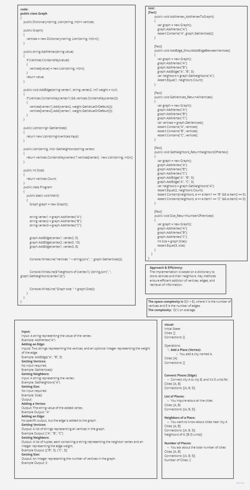
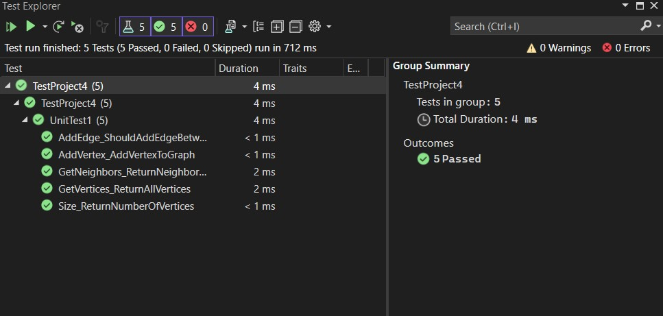

# Graph Implementation in C#

## Table of Contents
- [Summary](#summary)
- [Description](#description)
- [Approach & Efficiency](#approach--efficiency)
- [Solution](#solution)
- [Picture of Whiteboard](#picture-of-whiteboard)
- [Link to Code](#link-to-code)
- [Feature Tasks](#feature-tasks)
- [Unit Tests](#unit-tests)

## Summary

This C# project implements an undirected graph data structure, providing flexibility for modeling relationships between vertices. The README details the structure, usage, and testing of the implementation.

## Description

The project consists of a `Graph` class representing the undirected graph. Vertices and edges can be added, and information about the graph, such as vertices and neighbors, can be retrieved.

## Approach & Efficiency

The implementation is based on a dictionary to store vertices and their neighbors. Key methods ensure efficient addition of vertices, edges, and retrieval of information.

## Solution

An example usage of the graph is provided in the README, demonstrating how to create a graph, add vertices and edges, and retrieve information.

## Picture of Whiteboard

## Link to Code

[ Press to see the code](./Program.cs)
## Feature Tasks

- [x] Implement the `Graph` class.
- [x] Add vertices and edges to the graph.
- [x] Retrieve information about the graph.

## Unit Tests

### "Happy Path" - Expected Outcome

- [x] Adding vertices successfully.
- [x] Adding edges successfully.
- [x] Retrieving vertices and neighbors successfully.

### Expected Failure

- [ ] There are no failures.

