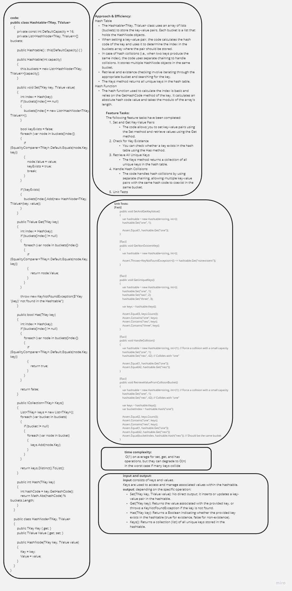
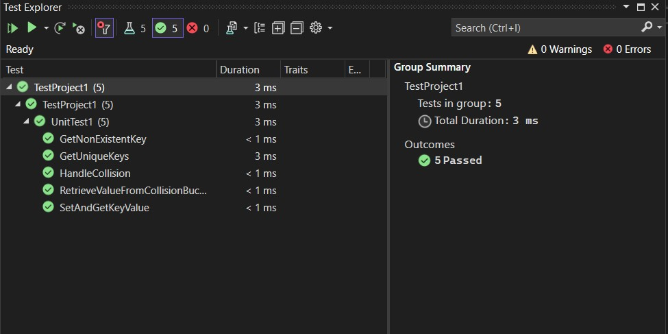

# Hash Table Implementation 

## Table of Contents
- [Description](#description)
- [Approach & Efficiency](#approach--efficiency)
- [Solution](#solution)
- [Code](#code)
- [Feature Tasks](#feature-tasks)
- [Unit Tests](#unit-tests)

---

## Description

This project implements a hash table data structure in C# using generics. A hash table is a data structure that allows for efficient key-value pair storage and retrieval. The provided code includes a `Hashtable<TKey, TValue>` class, which allows you to set, get, check for the existence of, and retrieve keys. The code also includes a `HashNode<TKey, TValue>` class, which represents the key-value pair within the hash table.

## Approach & Efficiency

### Hash Table
- The `Hashtable<TKey, TValue>` class uses an array of lists (`buckets`) to store the key-value pairs. Each bucket is a list that holds the `HashNode` objects.
- When setting a key-value pair, the code calculates the hash code of the key and uses it to determine the index in the `buckets` array where the pair should be stored.
- In case of hash collisions (i.e., when two keys produce the same index), the code uses separate chaining to handle collisions. It stores multiple `HashNode` objects in the same bucket.
- Retrieval and existence checking involve iterating through the appropriate bucket and searching for the key.
- The `Keys` method returns all unique keys in the hash table.

### Hash Function
- The hash function used to calculate the index is basic and relies on the `GetHashCode` method of the key. It calculates an absolute hash code value and takes the modulo of the array's length.

## Solution

The solution provides a basic implementation of a hash table in C#. While it is functional, it may not be the most efficient implementation for large datasets, as the hash function and collision handling strategy are relatively simple.

## Code

You can find the complete code in the [Hash_Tables_CC30](./Hashtable.cs) directory.

## Feature Tasks

The following feature tasks have been completed:

1. **Set and Get Key-Value Pairs**
   - The code allows you to set key-value pairs using the `Set` method and retrieve values using the `Get` method.

2. **Check for Key Existence**
   - You can check whether a key exists in the hash table using the `Has` method.

3. **Retrieve All Unique Keys**
   - The `Keys` method returns a collection of all unique keys in the hash table.

4. **Handle Hash Collisions**
   - The code handles hash collisions by using separate chaining, allowing multiple key-value pairs with the same hash code to coexist in the same bucket.

5. **Unit Tests**
   - Unit tests have been written to ensure the functionality of the hash table.
   - Tests cover the "happy path" scenarios, expected failures (e.g., retrieving a non-existent key), and edge cases (e.g., collisions).

## Unit Tests

Unit tests have been implemented to validate the functionality of the hash table. These tests include:

1. **Set and Get Key-Value Pair**
   - Verifies that a key-value pair can be set and retrieved correctly.

2. **Get Non-Existent Key**
   - Checks that attempting to retrieve a non-existent key results in a `KeyNotFoundException`.

3. **Get Unique Keys**
   - Ensures that the `Keys` method correctly returns all unique keys in the hash table.

4. **Handle Collision**
   - Tests collision handling by forcing a collision with a small capacity and ensuring that both colliding keys can be retrieved correctly.

5. **Retrieve Value from Collision Bucket**
   - Verifies that keys that collide are stored in the same bucket and can be retrieved properly.

All unit tests are passing.

---

You can access the code [here](./TestProject1/UnitTest1.cs).

---

This README file provides an overview of the implemented hash table and its functionality. It also highlights the completion of feature tasks and successful unit testing to ensure the code's reliability and correctness. The code is available in the provided directory, and a link to the whiteboard image and code is also provided for reference.
