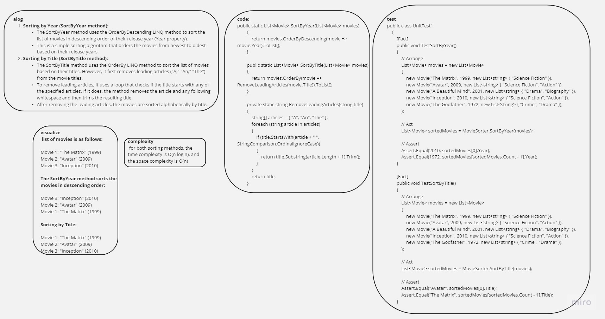

Movie Class (Movie.cs):

This class represents a movie with properties like Title, Year, and Genres.
It has a constructor to initialize these properties when creating a new instance of a movie.
MovieSorter Class (MovieSorter.cs):

This class contains two static methods for sorting a list of movies:
SortByYear: Sorts movies by the release year in descending order.
SortByTitle: Sorts movies by title, ignoring leading articles ("A," "An," "The").
Program Class (Program.cs):

The Main method serves as the entry point for the application.
It creates a list of movies, sorts them using the MovieSorter methods, and then prints the sorted movies.
PrintMovies Method:

This method is used to print the details of sorted movies, including their title, year, and genres.
Sample Data:

The program demonstrates the sorting functionality using a list of movies with various titles, years, and genres.
The main functionality of this program is to showcase how movies can be sorted based on their release year and title, with special handling for leading articles in titles.

When you run this program, it will first display the movies sorted by year and then by title (ignoring leading articles). The output will show the sorted movies' titles, release years, and genres.

