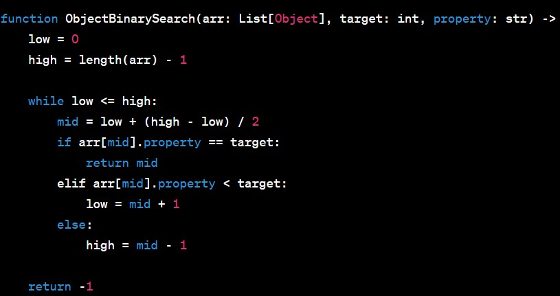

# Binary Search in a Sorted 1D Array
## Problem Statement
You are given a sorted 1D array and a search key. Your task is to implement the BinarySearch function to find the index of the array's element that is equal to the value of the search key. If the element is not found, return -1.

The search algorithm used in your function should be a binary search, which is an efficient algorithm for searching in sorted arrays.

## Function Signature

## Input
The function BinarySearch takes in two parameters:

arr (a sorted list of integers): The array in which the search will be performed.
target (an integer): The value to search for in the array.
Output
The function should return an integer representing the index of the element in the array that is equal to the target value. If the element is not found, return -1.

## Example

## Constraints
The input array arr is guaranteed to be sorted in ascending order.
The length of the input array arr will not exceed 10^6.
The values in the input array arr will be unique.
Resources
Wikipedia: Binary Search Algorithm
## Stretch Goal
Note: The stretch goal is optional and not required to complete the main problem.

If the array contained objects sorted based on a given property, and you were searching for a certain property value, you would need to modify the binary search algorithm accordingly. Here is the pseudocode for performing binary search on an array of objects based on a specific property value:
