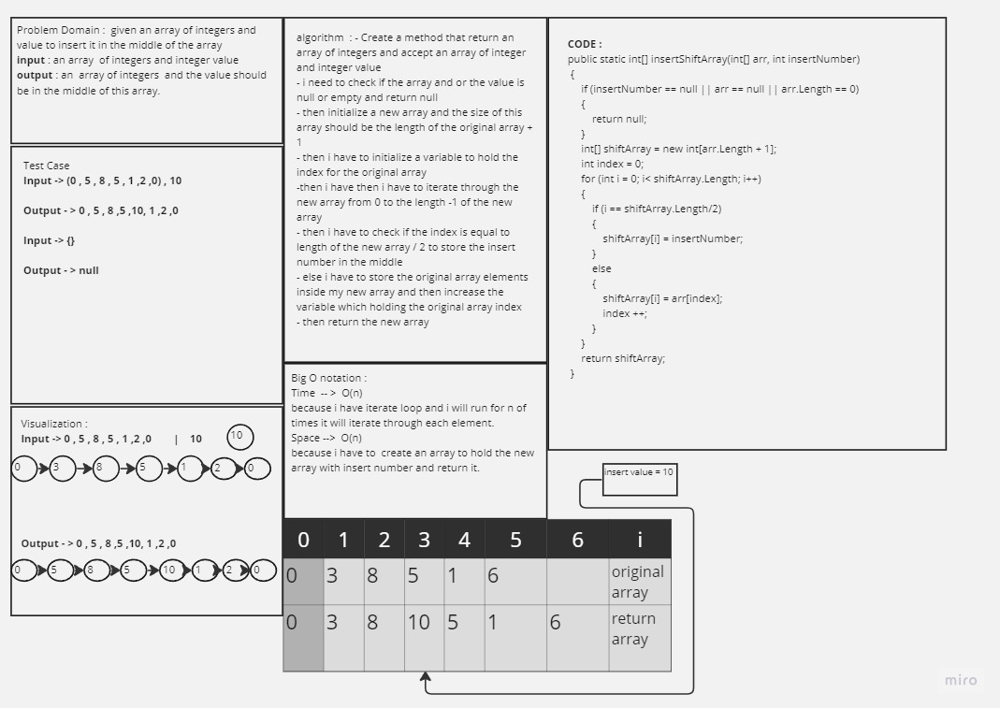

# data-structures-and-algorithms

 [Linked Lists insertion](/linked-list-insertions/Redme.md)

 [linked-list-kth](https://github.com/ahmadjamalkhater/linked-list-kth)
 
[stack-and-queue](https://github.com/ahmadjamalkhater/data-structures-and-algorithms./blob/master/challenge10/stack-and-queue/Redme.md)
