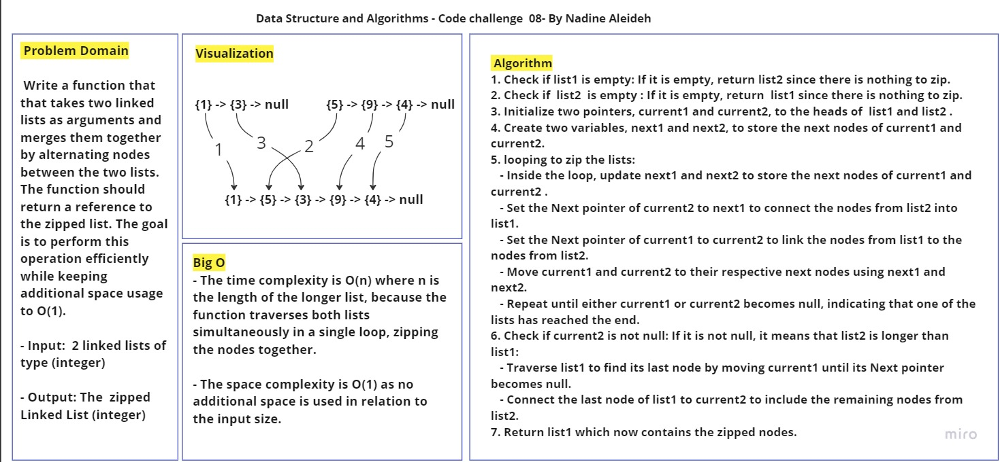
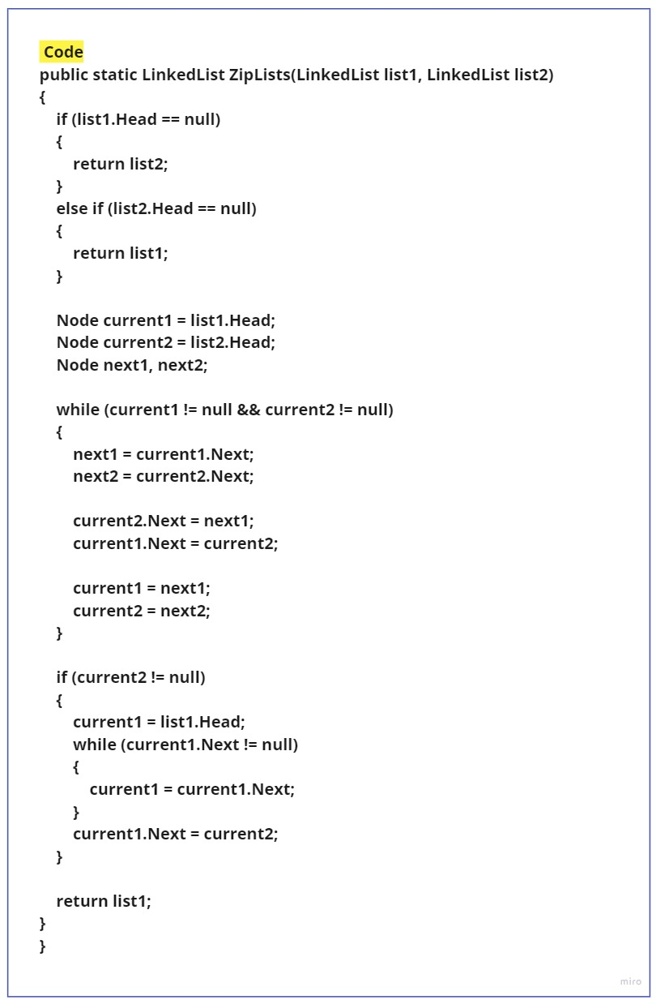
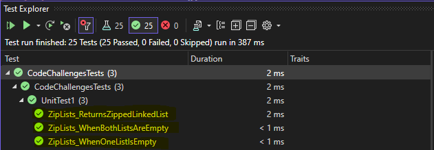

# Challenge Title: LinkedList Implementation

## Description

This code challenge focuses on linking two linked lists and merges them together by alternating nodes between the two lists. The function should return a reference to the zipped list. The goal is to perform this operation efficiently while keeping additional space usage to O(1).


## Method Inputs & Outputs , Approach & Efficiency

- **ZipLists(LinkedList list1, LinkedList list2):** return a reference to the zipped list.

  - Input: 2 linked lists.
  - Output: The zipped Linked List.

  - Approach:
    1. Check if either of the input lists is empty. If one list is empty, return the other list.
    2. Initialize two pointers, `current1` and `current2`, to the heads of the input lists.
    3. Traverse the lists simultaneously and update the pointers to alternate between the nodes of the two lists. 
    4. If one list is longer than the other, connect the remaining nodes to the end of the merged list.
    5. Return the zipped list.

  - Time Complexity: O(n)
  - Space Complexity: O(1)

## Whiteboard Process





## Solution & Tests

- The code for the linked list implementation can be found in the [Node.cs](../../DataStructures/Node.cs) and [LinkedList.cs](../../DataStructures/LinkedList.cs) files.
- The code for the **ZipLists** function can be found in the [LinkedLists.cs](../LinkedLists.cs) files.
- To run the code, you can follow the example written in the Main method in the [Program.cs](../Program.cs) file:

```

    LinkedList list1 = new LinkedList();
    list1.Append(1);
    list1.Append(3);
     
    LinkedList list2 = new LinkedList();
    list2.Append(5);
    list2.Append(9);
    list2.Append(4);

    LinkedList zippedList = LinkedLists.ZipLists(list1, list2);
    Console.WriteLine(zippedList.ToString());

```


