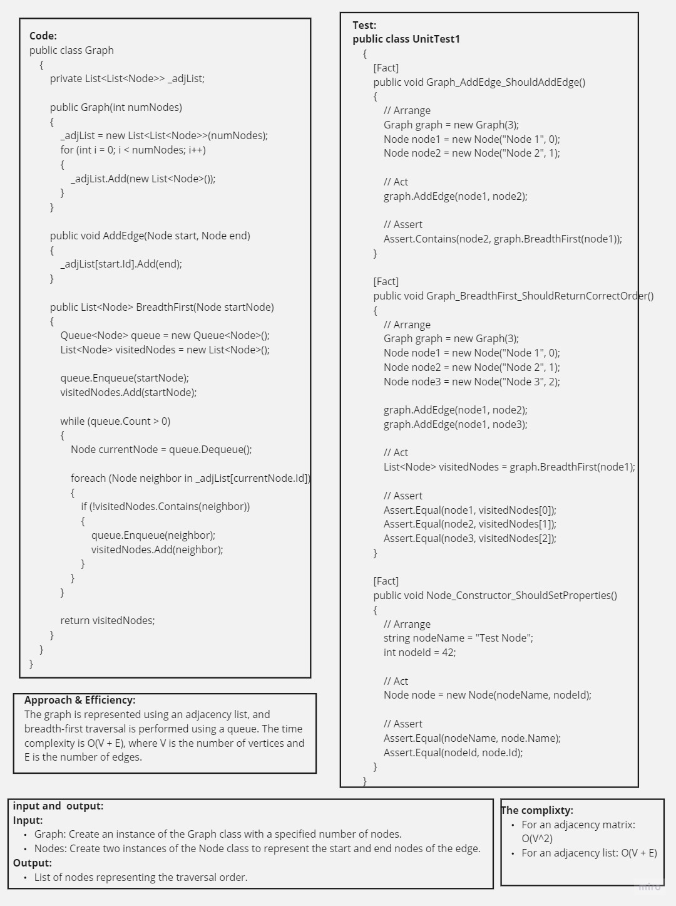
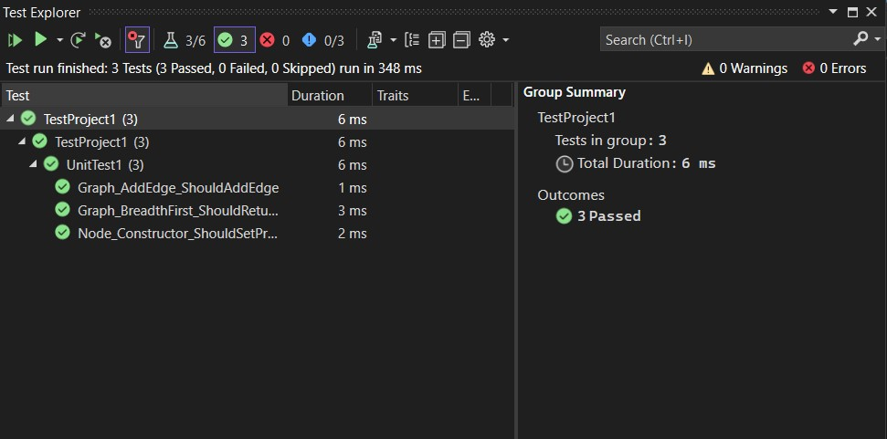

# Graph Breadth-First Traversal Challenge

## Table of Contents
- [Graph Breadth-First Traversal Challenge](#graph-breadth-first-traversal-challenge)
  - [Summary](#summary)
  - [Description](#description)
  - [Approach & Efficiency](#approach--efficiency)
  - [Solution](#solution)
  - [Picture of Whiteboard](#picture-of-whiteboard)
  - [Link to Code](#link-to-code)
  - [Feature Tasks](#feature-tasks)
  - [Unit Tests](#unit-tests)
    - [Happy Path - Expected Outcome](#happy-path---expected-outcome)
    - [Expected Failure](#expected-failure)

## Summary
This challenge involves implementing graph breadth-first traversal and writing unit tests for the implementation.

## Description
The provided code includes a graph class and related functionalities for breadth-first traversal. The main program demonstrates the traversal on a sample graph.

## Approach & Efficiency
The graph is represented using an adjacency list, and breadth-first traversal is performed using a queue. The time complexity is O(V + E), where V is the number of vertices and E is the number of edges.

## Solution
The solution involves creating a graph, adding edges, and performing breadth-first traversal. Check the code for detailed implementation.

## Picture of Whiteboard

## Link to Code
[Code](./Graph.cs)

## Feature Tasks
- [x] Implement graph breadth-first traversal.
- [x] Write unit tests for the graph implementation.

## Unit Tests

### Happy Path - Expected Outcome
1. Graph_AddEdge_ShouldAddEdge
   - Arrange: Create a graph and two nodes.
   - Act: Add an edge between nodes.
   - Assert: Ensure the second node is in the correct traversal order.

2. Graph_BreadthFirst_ShouldReturnCorrectOrder
   - Arrange: Create a graph and three nodes, adding edges between them.
   - Act: Perform breadth-first traversal.
   - Assert: Ensure the traversal order is correct.

3. Node_Constructor_ShouldSetProperties
   - Arrange: Define a node with a name and ID.
   - Act: Create a node.
   - Assert: Ensure the node's properties are set correctly.

### Expected Failure
Nathing failures

