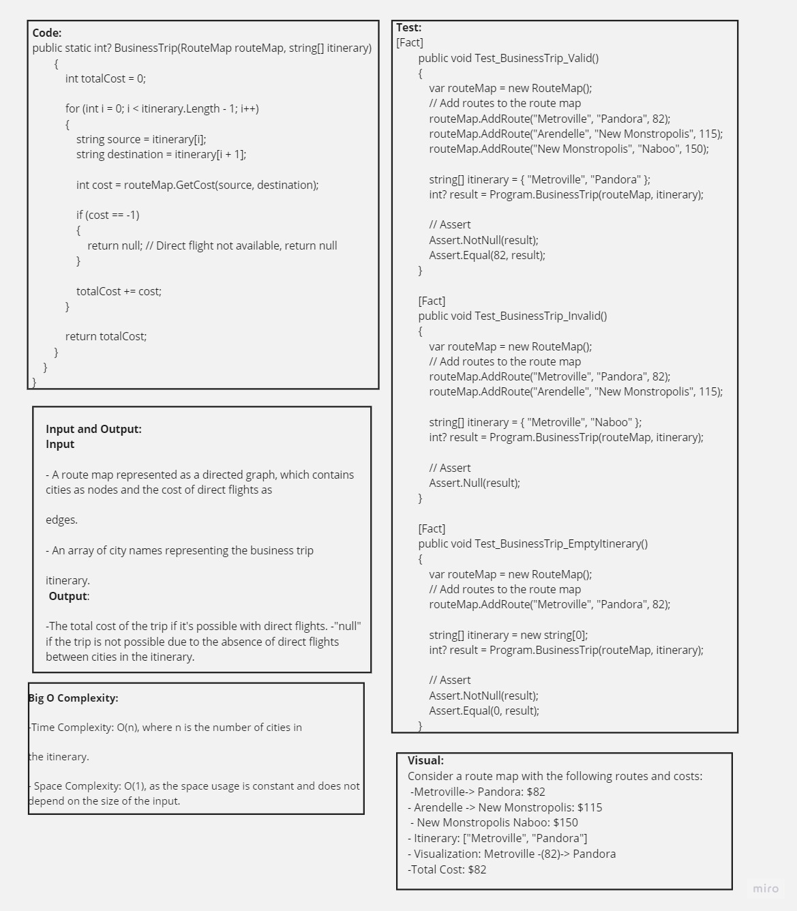

# Graph Traversal and Business Trip Challenge

## Table of Contents
1. [Description](#description)
2. [Approach & Efficiency](#approach--efficiency)
3. [Solution](#solution)
4. [Code](#code)
5. [Feature Tasks](#feature-tasks)
6. [Unit Tests](#unit-tests)

## Description

This coding challenge involves working with graphs to implement breadth-first and depth-first traversal. Additionally, there's a business trip itinerary problem where the cost of traveling between cities needs to be calculated.

## Approach & Efficiency

The provided solution uses a graph class with methods for adding vertices, edges, and performing graph traversals (Breadth-First and Depth-First). There's also a `RouteMap` class for handling the business trip itinerary.

## Solution



### Graph Class
- Methods for adding vertices and edges to the graph.
- Breadth-first traversal (`BreadthFirstTraversal` method).
- Depth-first pre-order traversal (`DepthFirstPreOrder` method).

### RouteMap Class
- Method for adding routes between cities.
- Method for getting the cost of traveling between two cities.

### Business Trip Function
- `BusinessTrip` function takes a `RouteMap` and an itinerary, calculates the total cost of the trip, and returns `null` if a direct flight is not available.

## Code

[Link to Code](./RouteMap.cs) 

## Feature Tasks

- [x] Graph class with basic graph operations.
- [x] RouteMap class for handling routes and costs.
- [x] Implementation of breadth-first and depth-first traversal.
- [x] `BusinessTrip` function calculating the total cost of an itinerary.

## Unit Tests

```csharp
using graphs;
using Xunit;

namespace testGraph
{
    public class UnitTest1
    {

        [Fact]
        public void Test_BusinessTrip_Valid()
        {
            var routeMap = new RouteMap();
            // Add routes to the route map
            routeMap.AddRoute("Metroville", "Pandora", 82);
            routeMap.AddRoute("Arendelle", "New Monstropolis", 115);
            routeMap.AddRoute("New Monstropolis", "Naboo", 150);

            string[] itinerary = { "Metroville", "Pandora" };
            int? result = Program.BusinessTrip(routeMap, itinerary);

            // Assert
            Assert.NotNull(result);
            Assert.Equal(82, result);
        }

        [Fact]
        public void Test_BusinessTrip_Invalid()
        {
            var routeMap = new RouteMap();
            // Add routes to the route map
            routeMap.AddRoute("Metroville", "Pandora", 82);
            routeMap.AddRoute("Arendelle", "New Monstropolis", 115);

            string[] itinerary = { "Metroville", "Naboo" };
            int? result = Program.BusinessTrip(routeMap, itinerary);

            // Assert
            Assert.Null(result);
        }

        [Fact]
        public void Test_BusinessTrip_EmptyItinerary()
        {
            var routeMap = new RouteMap();
            // Add routes to the route map
            routeMap.AddRoute("Metroville", "Pandora", 82);

            string[] itinerary = new string[0];
            int? result = Program.BusinessTrip(routeMap, itinerary);

            // Assert
            Assert.NotNull(result);
            Assert.Equal(0, result);
        }
    }
}
