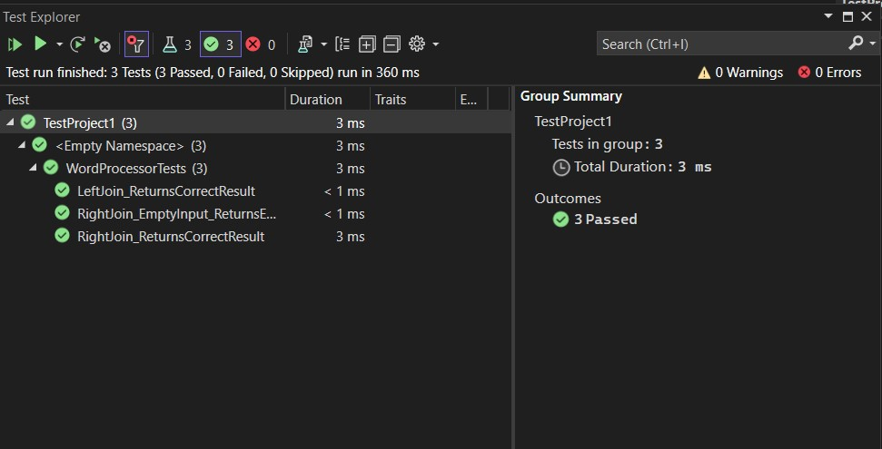

# Left Join and Right Join of Synonyms and Antonyms

## Table of Contents
- [Description](#description)
- [Approach & Efficiency](#approach--efficiency)
- [Solution](#solution)
- [Picture of Whiteboard](#picture-of-whiteboard)
- [Link to Code](#link-to-code)
- [Unit Tests](#unit-tests)
 

---

## Description
This code demonstrates left join and right join operations on two dictionaries: one containing synonyms and the other containing antonyms. The code provides two methods, `LeftJoin` and `RightJoin`, which perform these operations and return the results as lists of arrays.

---

## Approach & Efficiency
### Left Join
- For each key in the `synonyms` dictionary:
  - If the key exists in the `antonyms` dictionary, a row with the key, synonym value, and antonym value is added to the result list.
  - If the key does not exist in the `antonyms` dictionary, a row with the key, synonym value, and a null value for antonym is added to the result list.

### Right Join
- For each key in the `antonyms` dictionary:
  - If the key exists in the `synonyms` dictionary, a row with the key, synonym value, and antonym value is added to the result list.
  - If the key does not exist in the `synonyms` dictionary, a row with the key, a null value for synonym, and antonym value is added to the result list.

Time Complexity: O(n), where n is the number of keys in the dictionaries.

Space Complexity: O(n), as the result list is populated with n rows.

---

## Solution
- [Link to Code](./Program.cs)

---

## Picture of Whiteboard
- [Whiteboard Picture](./Whiteboard.jpg) 

---

## Unit Tests

