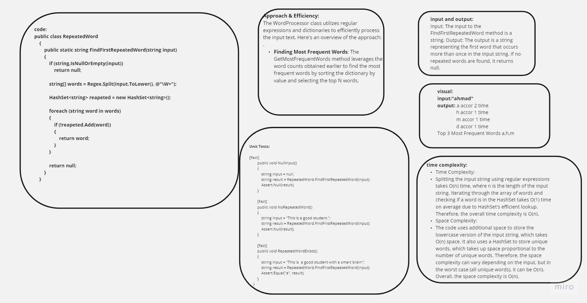
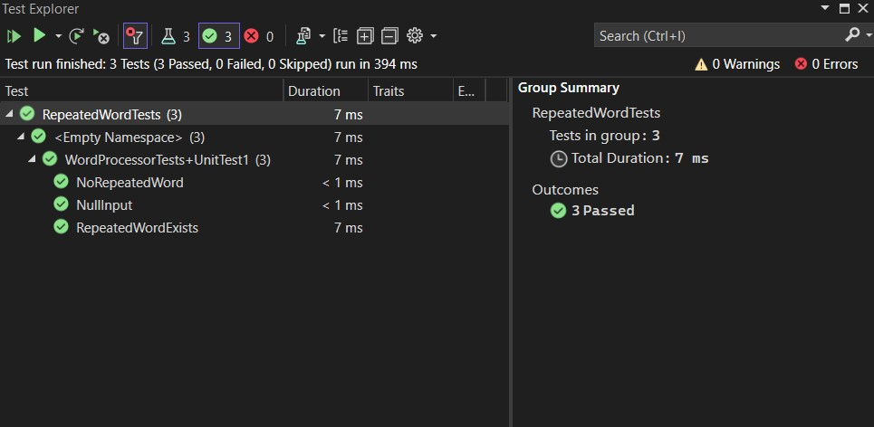

# Word Processor

## Table of Contents

- [Description](#description)
- [Approach & Efficiency](#approach--efficiency)
- [Solution](#solution)
- [Code](#code)
- [Unit Tests](#unit-tests)

## Description

 

The FindFirstRepeatedWord method uses regular expressions and a HashSet to split the input string into words, convert them to lowercase for case-insensitivity, and then identify the first repeated word in the string.  

## Solution

The solution provides a basic yet functional word processor in C# for word counting and finding the most frequent words. It can be used for various text analysis tasks.

## Code

You can find the complete code in [repeated-word](./WordProcessor.cs) files.

## Unit Tests

