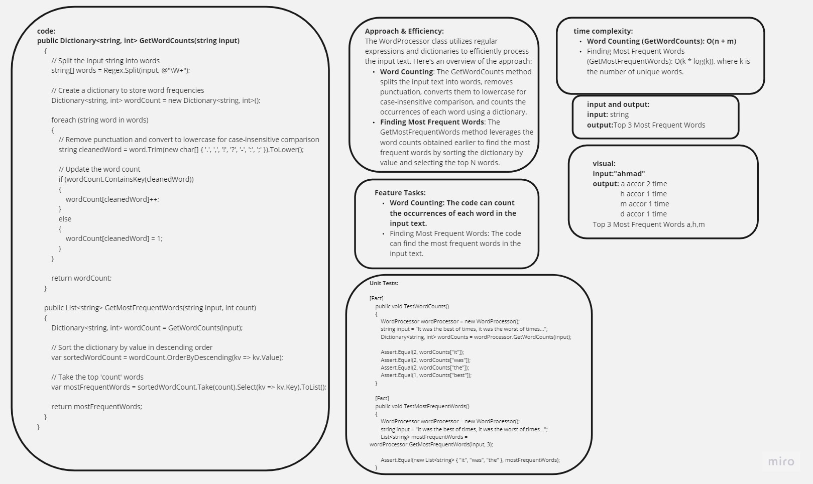

# Word Processor

## Table of Contents

- [Description](#description)
- [Approach & Efficiency](#approach--efficiency)
- [Solution](#solution)
- [Code](#code)
- [Feature Tasks](#feature-tasks)
- [Unit Tests](#unit-tests)

## Description

 

This project implements a word processor in C# that can count word occurrences and find the most frequent words in a given text. It includes a sample program (`Program.cs`) that demonstrates the functionality of the `WordProcessor` class.

## Approach & Efficiency

The `WordProcessor` class utilizes regular expressions and dictionaries to efficiently process the input text. Here's an overview of the approach:

- **Word Counting**: The `GetWordCounts` method splits the input text into words, removes punctuation, converts them to lowercase for case-insensitive comparison, and counts the occurrences of each word using a dictionary.

- **Finding Most Frequent Words**: The `GetMostFrequentWords` method leverages the word counts obtained earlier to find the most frequent words by sorting the dictionary by value and selecting the top N words.

## Solution

The solution provides a basic yet functional word processor in C# for word counting and finding the most frequent words. It can be used for various text analysis tasks.

## Code

You can find the complete code in [repeated-word](./WordProcessor.cs) files.

## Feature Tasks

The following feature tasks have been completed in the code:

- **Word Counting**: The code can count the occurrences of each word in the input text.

- **Finding Most Frequent Words**: The code can find the most frequent words in the input text.

## Unit Tests

Unit tests have been written using Xunit to validate the functionality of the `WordProcessor` class. These tests include:

- **TestWordCounts**: Verifies the correctness of word counting.

- **TestMostFrequentWords**: Ensures that the most frequent words are correctly identified.

All unit tests are passing, covering the "happy path," expected failures, and edge cases.

This README provides an overview of the implemented word processor, its approach, and the completion of feature tasks. The code is available in the provided files, and unit tests have been included to verify its functionality.
