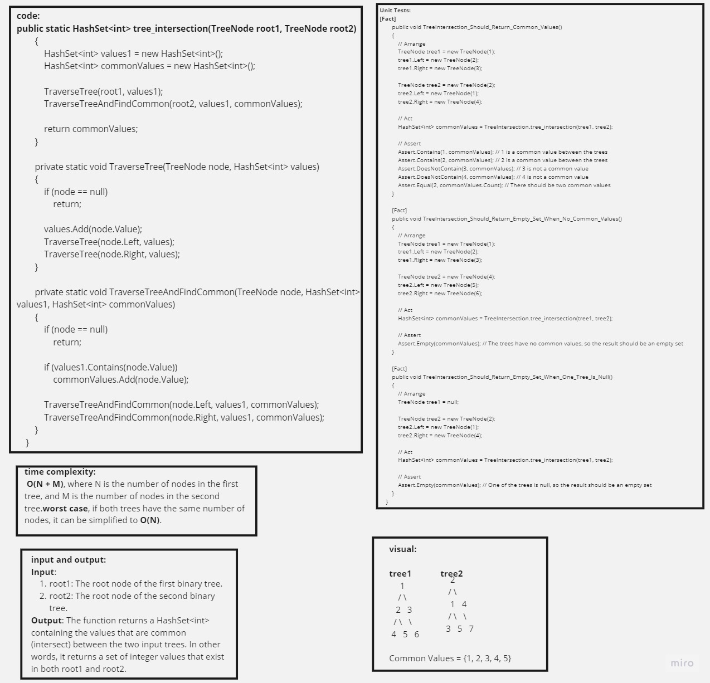
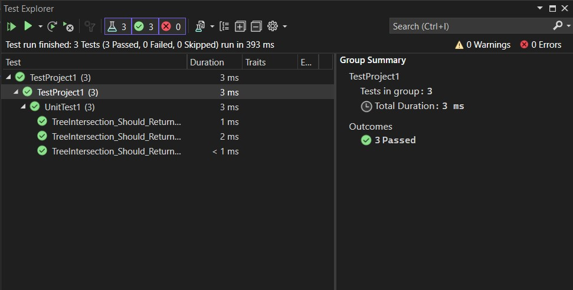

# Tree Intersection

## Table of Contents
- [Description](#description)
- [Code](#code)
- [Unit Tests](#unit-tests)

---

## Description

The `Tree_intersection` project is designed to find common values between two binary trees. A binary tree is a data structure where each node has, at most, two child nodes: a left child and a right child. This project provides a `TreeIntersection` class that contains a method named `tree_intersection`, which takes two binary trees as input and returns a HashSet containing the common values found in both trees.

## Code

You can find the complete code in the [Tree_intersection](./TreeIntersection.cs) directory.

---

## Unit Tests

Unit tests have been implemented to validate the functionality of the `Tree_intersection` class. These tests include:

1. **Find Common Values Between Trees**
   - Verifies that the `tree_intersection` method returns the correct HashSet of common values between two trees.

2. **Find Common Values When No Common Values Exist**
   - Checks that the `tree_intersection` method correctly returns an empty HashSet when there are no common values between the trees.

3. **Find Common Values When One Tree is Empty**
   - Ensures that the `tree_intersection` method handles the case when one of the input trees is empty and correctly returns an empty HashSet.

All unit tests are passing.

---

This README file provides an overview of the `Tree_intersection` project, explaining its purpose and functionality. The code can be found in the provided directory, and unit tests have been implemented to validate its correctness and reliability. A link to the code and images is provided for reference.
